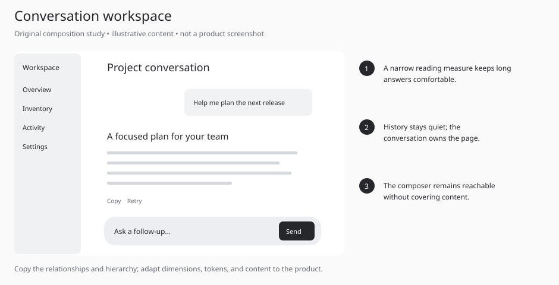
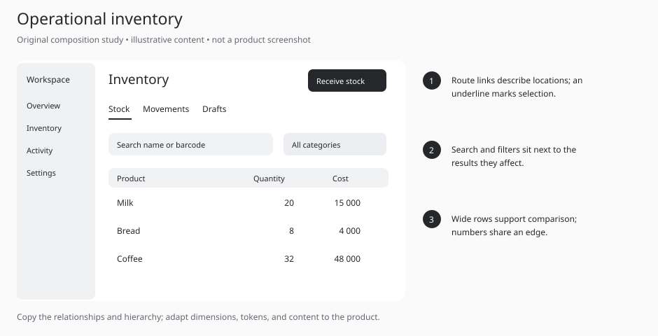
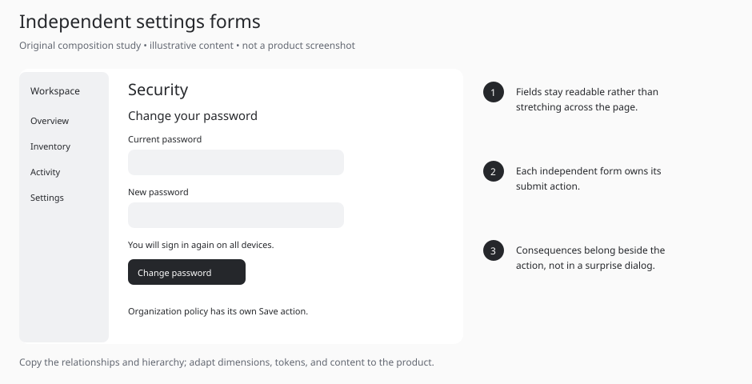
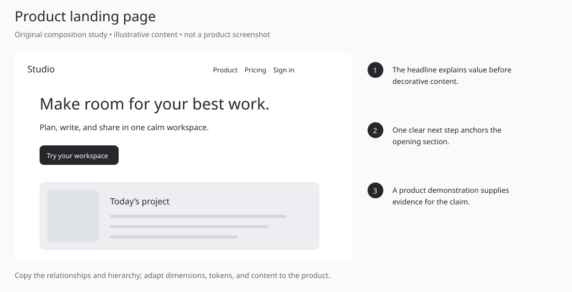
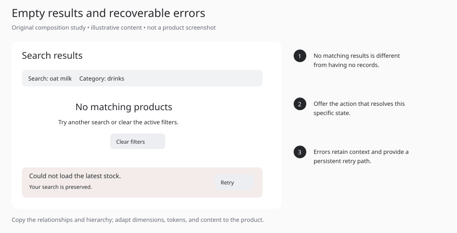
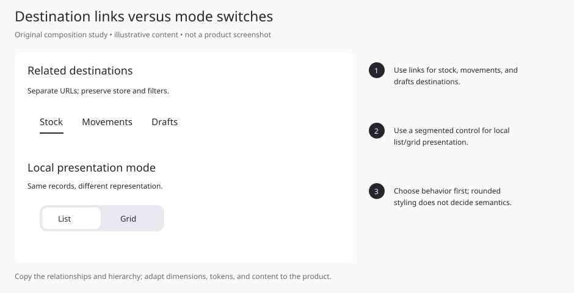

# Six annotated composition studies

Original teaching diagrams created for this skill. These are not screenshots of ChatGPT or any other product, not user-approved visual references, and not production components. Their neutral palette illustrates hierarchy; implementations must use the target project's semantic tokens. Read only the study relevant to the task.

## Conversation workspace

**Take:** A narrow reading measure keeps long answers comfortable. History stays quiet; the conversation owns the page. The composer remains reachable without covering content.

**Avoid:** Boxing every message, oversized navigation, or forcing auto-scroll while the user reads earlier content.

**Adapt:** This is a composition diagram, not a fixed template. Use existing product tokens, real content, and supported interaction patterns.

## Operational inventory

**Take:** Route links describe locations; an underline marks selection. Search and filters sit next to the results they affect. Wide rows support comparison; numbers share an edge.

**Avoid:** Using a large pill switch for unrelated routes, stretching KPI cards to fill space, or losing filters between destinations.

**Adapt:** This is a composition diagram, not a fixed template. Use existing product tokens, real content, and supported interaction patterns.

## Independent settings forms

**Take:** Fields stay readable rather than stretching across the page. Each independent form owns its submit action. Consequences belong beside the action, not in a surprise dialog.

**Avoid:** A global Save button that appears to submit unrelated forms; persisting passwords as drafts.

**Adapt:** This is a composition diagram, not a fixed template. Use existing product tokens, real content, and supported interaction patterns.

## Product landing page

**Take:** The headline explains value before decorative content. One clear next step anchors the opening section. A product demonstration supplies evidence for the claim.

**Avoid:** Generic decorative gradients, invented customer proof, or a headline that never explains the product.

**Adapt:** This is a composition diagram, not a fixed template. Use existing product tokens, real content, and supported interaction patterns.

## Empty results and recoverable errors

**Take:** No matching results is different from having no records. Offer the action that resolves this specific state. Errors retain context and provide a persistent retry path.

**Avoid:** Showing “No products” during an API failure, resetting the search on error, or relying on a disappearing toast.

**Adapt:** This is a composition diagram, not a fixed template. Use existing product tokens, real content, and supported interaction patterns.

## Destination links versus mode switches

**Take:** Use links for stock, movements, and drafts destinations. Use a segmented control for local list/grid presentation. Choose behavior first; rounded styling does not decide semantics.

**Avoid:** Treating segmented controls as the default for every kind of navigation or adding tab roles without tab keyboard behavior.

**Adapt:** This is a composition diagram, not a fixed template. Use existing product tokens, real content, and supported interaction patterns.
